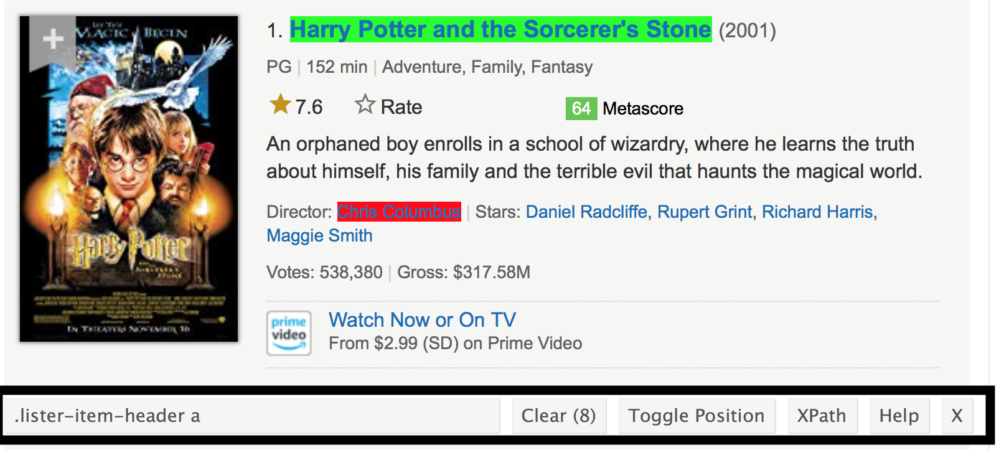

Reading\_Data\_From\_the\_Web
================
Jingyi
10/20/2019

As always, I’ll create a new GH Repo + local project called
data\_wrangling\_ii, and open a new R Markdown file called
reading\_data\_from\_the\_web.Rmd. Although we’ll mostly be getting data
from the web, we’ll revisit some of these examples, so I’ll create a
data subdirectory and put those in it.

There are some new additions to our standard packages (rvest and httr);
I’m loading everything we need now. Now’s also the time to “install” the
Selector Gadget.

``` r
library(tidyverse)
```

    ## -- Attaching packages ---------------- tidyverse 1.2.1 --

    ## v ggplot2 3.2.1     v purrr   0.3.2
    ## v tibble  2.1.3     v dplyr   0.8.3
    ## v tidyr   1.0.0     v stringr 1.4.0
    ## v readr   1.3.1     v forcats 0.4.0

    ## -- Conflicts ------------------- tidyverse_conflicts() --
    ## x dplyr::filter() masks stats::filter()
    ## x dplyr::lag()    masks stats::lag()

``` r
library(rvest)
```

    ## Loading required package: xml2

    ## 
    ## Attaching package: 'rvest'

    ## The following object is masked from 'package:purrr':
    ## 
    ##     pluck

    ## The following object is masked from 'package:readr':
    ## 
    ##     guess_encoding

``` r
library(httr)
```

## Extracting tables

This page
\[<http://samhda.s3-us-gov-west-1.amazonaws.com/s3fs-public/field-uploads/2k15StateFiles/NSDUHsaeShortTermCHG2015.htm>\]
contains data from the National Survey on Drug Use and Health; it
includes tables for drug use in the past year or month, separately for
specific kinds of drug use. These data are potentially useful for
analysis, and we’d like to be able to read in the first table.

First, let’s make sure we can load the data from the web.

``` r
url = "http://samhda.s3-us-gov-west-1.amazonaws.com/s3fs-public/field-uploads/2k15StateFiles/NSDUHsaeShortTermCHG2015.htm"
drug_use_xml = read_html(url)

drug_use_xml
```

    ## {html_document}
    ## <html lang="en">
    ## [1] <head>\n<link rel="P3Pv1" href="http://www.samhsa.gov/w3c/p3p.xml">\ ...
    ## [2] <body>\r\n\r\n<noscript>\r\n<p>Your browser's Javascript is off. Hyp ...

Doesn’t look like much, but we’re there. Rather than trying to grab
something using a CSS selector, let’s try our luck extracting the tables
from the HTML.

``` r
drug_use_xml %>%
  html_nodes(css = "table")
```

    ## {xml_nodeset (15)}
    ##  [1] <table class="rti" border="1" cellspacing="0" cellpadding="1" width ...
    ##  [2] <table class="rti" border="1" cellspacing="0" cellpadding="1" width ...
    ##  [3] <table class="rti" border="1" cellspacing="0" cellpadding="1" width ...
    ##  [4] <table class="rti" border="1" cellspacing="0" cellpadding="1" width ...
    ##  [5] <table class="rti" border="1" cellspacing="0" cellpadding="1" width ...
    ##  [6] <table class="rti" border="1" cellspacing="0" cellpadding="1" width ...
    ##  [7] <table class="rti" border="1" cellspacing="0" cellpadding="1" width ...
    ##  [8] <table class="rti" border="1" cellspacing="0" cellpadding="1" width ...
    ##  [9] <table class="rti" border="1" cellspacing="0" cellpadding="1" width ...
    ## [10] <table class="rti" border="1" cellspacing="0" cellpadding="1" width ...
    ## [11] <table class="rti" border="1" cellspacing="0" cellpadding="1" width ...
    ## [12] <table class="rti" border="1" cellspacing="0" cellpadding="1" width ...
    ## [13] <table class="rti" border="1" cellspacing="0" cellpadding="1" width ...
    ## [14] <table class="rti" border="1" cellspacing="0" cellpadding="1" width ...
    ## [15] <table class="rti" border="1" cellspacing="0" cellpadding="1" width ...

This has extracted **all of the tables** on the original page; that’s
why we have a list with 15 elements. (We haven’t really talked about
lists yet, but for now you can think of them as a general collection of
objects in R. As we proceed, syntax for extracting individual elements
from a list will become clear, and we’ll talk lots about lists in list
columns.)

We’re only **focused on the first table** for now, so let’s get the
contents from the first list element.

``` r
table_marj = 
  (drug_use_xml %>% html_nodes(css = "table")) %>% 
  .[[1]] %>%
  html_table() 
```

I won’t print the table here, but if you look at it you’ll notice a
problem: the “note” at the bottom of the table appears in every column
in the first row. We need to remove that; I’ll also convert to a tibble
so that things print nicely.

``` r
table_marj = 
  (drug_use_xml %>% html_nodes(css = "table")) %>% 
  .[[1]] %>%
  html_table() %>%
  slice(-1) %>% 
  as_tibble()

table_marj
```

    ## # A tibble: 56 x 16
    ##    State `12+(2013-2014)` `12+(2014-2015)` `12+(P Value)` `12-17(2013-201~
    ##    <chr> <chr>            <chr>            <chr>          <chr>           
    ##  1 Tota~ 12.90a           13.36            0.002          13.28b          
    ##  2 Nort~ 13.88a           14.66            0.005          13.98           
    ##  3 Midw~ 12.40b           12.76            0.082          12.45           
    ##  4 South 11.24a           11.64            0.029          12.02           
    ##  5 West  15.27            15.62            0.262          15.53a          
    ##  6 Alab~ 9.98             9.60             0.426          9.90            
    ##  7 Alas~ 19.60a           21.92            0.010          17.30           
    ##  8 Ariz~ 13.69            13.12            0.364          15.12           
    ##  9 Arka~ 11.37            11.59            0.678          12.79           
    ## 10 Cali~ 14.49            15.25            0.103          15.03           
    ## # ... with 46 more rows, and 11 more variables: `12-17(2014-2015)` <chr>,
    ## #   `12-17(P Value)` <chr>, `18-25(2013-2014)` <chr>,
    ## #   `18-25(2014-2015)` <chr>, `18-25(P Value)` <chr>,
    ## #   `26+(2013-2014)` <chr>, `26+(2014-2015)` <chr>, `26+(P Value)` <chr>,
    ## #   `18+(2013-2014)` <chr>, `18+(2014-2015)` <chr>, `18+(P Value)` <chr>

Success\!\! At least, mostly. These data aren’t tidy, but we’ll worry
about that soon.

## Learning assessment:

Create a data frame that contains the cost of living table for New York
from this page
\[<https://www.bestplaces.net/cost_of_living/city/new_york/new_york>\].

``` r
url = "https://www.bestplaces.net/cost_of_living/city/new_york/new_york"
cost_of_living_xml = read_html(url)

cost_of_living = 
  (cost_of_living_xml %>% html_nodes(css = "table")) %>% 
  .[[1]] %>%
  html_table(header = TRUE) 

cost_of_living
```

    ##     COST OF LIVING New York New York      USA
    ## 1          Overall    209.3    129.4      100
    ## 2          Grocery    114.7    101.7      100
    ## 3           Health      101    100.8      100
    ## 4          Housing      354    150.8      100
    ## 5 Median Home Cost $680,500 $305,400 $231,200
    ## 6        Utilities    150.5    115.9      100
    ## 7   Transportation    211.5    161.5      100
    ## 8    Miscellaneous    121.2    101.6      100

## CSS Selectors

Suppose we’d like to scrape the data about the Harry Potter Saga
\[<https://www.imdb.com/list/ls000630791/>\] from the IMDB page. The
first step is the same as before – we need to get the HTML.

``` r
hpsaga_html = 
  read_html("https://www.imdb.com/list/ls000630791/")
```

The information isn’t stored in a handy table, so we’re going to isolate
the CSS selector for elements we care about. A bit of clicking around
gets me something like below.



For each element, I’ll use the CSS selector in html\_nodes() to extract
the relevant HTML code, and convert it to text. Then I can combine these
into a data frame.

``` r
title_vec = 
  hpsaga_html %>%
  html_nodes(".lister-item-header a") %>%
  html_text()

gross_rev_vec = 
  hpsaga_html %>%
  html_nodes(".text-small:nth-child(7) span:nth-child(5)") %>%
  html_text()

runtime_vec = 
  hpsaga_html %>%
  html_nodes(".runtime") %>%
  html_text()

hpsaga_df = 
  tibble(
    title = title_vec,
    rev = gross_rev_vec,
    runtime = runtime_vec)
```

## Learning Assessment:

This page contains the 10 most recent reviews of the movie “Napoleon
Dynamite”. Use a process similar to the one above to extract the titles
of the reviews. Note: getting the star ratings from Amazon is trickier,
but the CSS path “\#cm\_cr-review\_list .review-rating” helps – I
discovered this after about an hour of googling around.

``` r
dynamite_html = read_html("https://www.amazon.com/product-reviews/B00005JNBQ/ref=cm_cr_arp_d_viewopt_rvwer?ie=UTF8&reviewerType=avp_only_reviews&sortBy=recent&pageNumber=1")

review_titles = 
  dynamite_html %>%
  html_nodes(".a-text-bold span") %>%
  html_text()

review_stars = 
  dynamite_html %>%
  html_nodes("#cm_cr-review_list .review-rating") %>%
  html_text()

review_text = 
  dynamite_html %>%
  html_nodes(".review-text-content span") %>%
  html_text()

reviews = tibble(
  title = review_titles,
  stars = review_stars,
  text = review_text)
```

## Using an API

New York City has a great open data resource, and we’ll use that for our
API examples. Although most (all?) of these datasets can be accessed by
clicking through a website, we’ll access them directly using the API to
improve reproducibility and make it easier to update results to reflect
new data.

As a simple example, this page
\[<https://data.cityofnewyork.us/Environment/Water-Consumption-In-The-New-York-City/ia2d-e54m>\]
is about a dataset for annual water consumption in NYC, along with the
population in that year. First, we’ll import this as a CSV and parse it.

``` r
nyc_water = 
  GET("https://data.cityofnewyork.us/resource/waf7-5gvc.csv") %>% 
  content("parsed")
```

    ## Parsed with column specification:
    ## cols(
    ##   year = col_double(),
    ##   new_york_city_population = col_double(),
    ##   nyc_consumption_million_gallons_per_day = col_double(),
    ##   per_capita_gallons_per_person_per_day = col_double()
    ## )

We can also import this dataset as a JSON file. This takes a bit more
work (and this is, really, a pretty easy case), but it’s still doable.

``` r
nyc_water = 
  GET("https://data.cityofnewyork.us/resource/waf7-5gvc.json") %>% 
  content("text") %>%
  jsonlite::fromJSON() %>%
  as_tibble()
```

Data.gov
\[<https://catalog.data.gov/dataset?q=-aapi+api+OR++res_format%3Aapi#topic=developers_navigation>\]
also has a lot of data available using their API; often this is
available as CSV or JSON as well. For example, we might be interested in
data coming from BRFSS
\[<https://catalog.data.gov/dataset/behavioral-risk-factors-selected-metropolitan-area-risk-trends-smart-county-prevalence-dat-a0124>\].
This is importable via the API as a CSV (JSON, in this example, is much
more complicated \[<https://p8105.com/dataset_brfss.html>\]).

``` r
brfss_smart2010 = 
  GET("https://data.cdc.gov/api/views/acme-vg9e/rows.csv?accessType=DOWNLOAD") %>% 
  content("parsed")
```

    ## Parsed with column specification:
    ## cols(
    ##   .default = col_character(),
    ##   Year = col_double(),
    ##   Sample_Size = col_double(),
    ##   Data_value = col_double(),
    ##   Confidence_limit_Low = col_double(),
    ##   Confidence_limit_High = col_double(),
    ##   Display_order = col_double(),
    ##   LocationID = col_logical()
    ## )

    ## See spec(...) for full column specifications.

Both of the previous examples are extremely easy – we accessed data that
is essentially a data table, and we had a very straightforward API.

To get a sense of how this becomes complicated, let’s look at the
Pokemon API \[<https://pokeapi.co/>\] (which is also pretty nice).

``` r
poke = 
  GET("http://pokeapi.co/api/v2/pokemon/1") %>%
  content()

poke$name
```

    ## [1] "bulbasaur"

``` r
poke$height
```

    ## [1] 7

``` r
poke$abilities
```

    ## [[1]]
    ## [[1]]$ability
    ## [[1]]$ability$name
    ## [1] "chlorophyll"
    ## 
    ## [[1]]$ability$url
    ## [1] "https://pokeapi.co/api/v2/ability/34/"
    ## 
    ## 
    ## [[1]]$is_hidden
    ## [1] TRUE
    ## 
    ## [[1]]$slot
    ## [1] 3
    ## 
    ## 
    ## [[2]]
    ## [[2]]$ability
    ## [[2]]$ability$name
    ## [1] "overgrow"
    ## 
    ## [[2]]$ability$url
    ## [1] "https://pokeapi.co/api/v2/ability/65/"
    ## 
    ## 
    ## [[2]]$is_hidden
    ## [1] FALSE
    ## 
    ## [[2]]$slot
    ## [1] 1

To build a Pokemon dataset for analysis, you’d need to distill the data
returned from the API into a useful format; iterate across all pokemon;
and combine the results.

For both of the API examples we saw today, it wouldn’t be terrible to
just download the CSV, document where it came from carefully, and move
on. APIs are more helpful when the full dataset is complex and you only
need pieces, or when the data are updated regularly.

## Be reasonable

When you’re reading data from the web, remember you’re accessing
resources on someone else’s server – either by reading HTML or by
accessing data via an API. In some cases, those who make data public
will take steps to limit bandwidth devoted to a small number of users.
Amazon and IMDB, for example, probably won’t notice if you scrape small
amounts of data but would notice if you tried to read data from
thousands of pages every time you knitted a document.

Similarly, API developers can (and will) limit the number of database
entries that can be accessed in a single request. In those cases you’d
have to take some steps to iterate over “pages” and combine the results;
as an example, our code for the NYC Restaurant Inspections does this
\[<https://p8105.com/dataset_restaurant_inspections.html>\]. In some
cases, API developers protect themselves from unreasonable use by
requiring users to be authenticated – it’s still possible to use httr in
these cases, but we won’t get into it.
