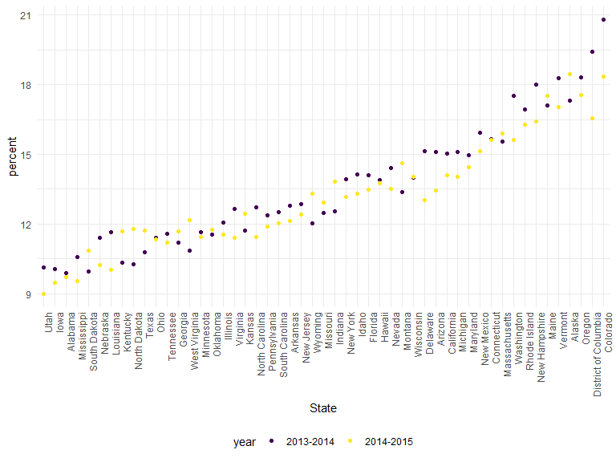
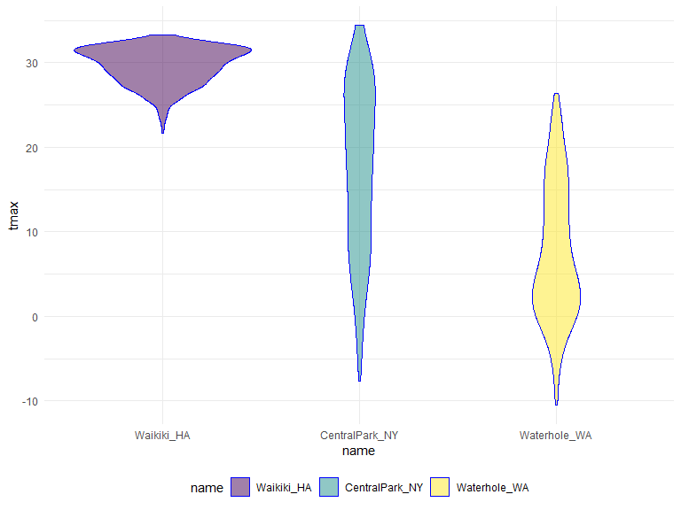
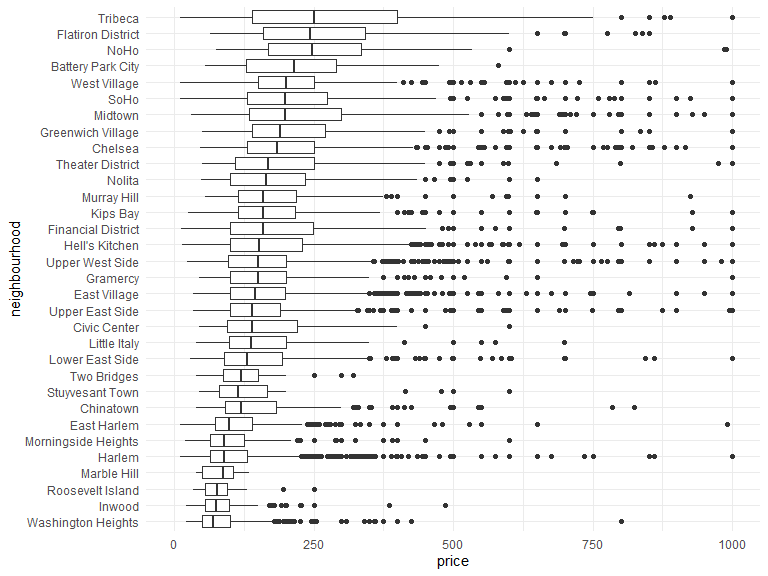
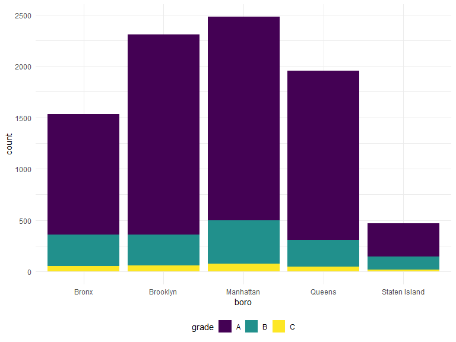
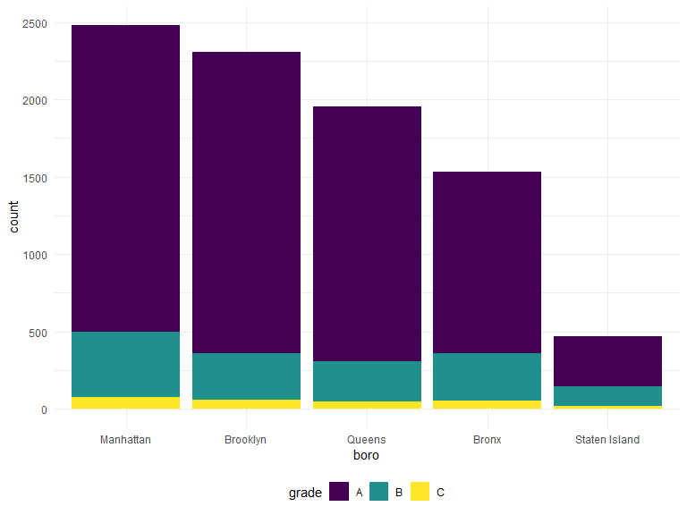
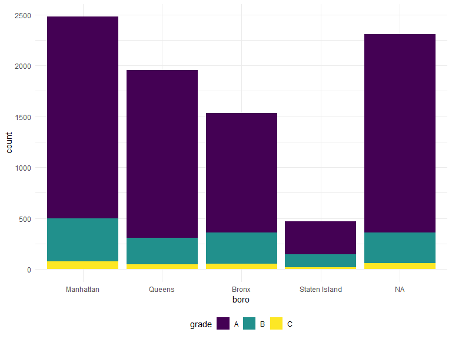

strings\_and\_factors
================
Jingyi
10/21/2019

**Example**

I’ll write code for today’s content in a new R Markdown document called
strings\_and\_factors.Rmd, and put it in the same directory / GitHub
repo as reading\_data.Rmd. Since we’ll revisit some scraped examples,
I’ll load rvest now; we’ll also use some datasets in p8105.datasets so
I’ll load that as well. And finally, we’ll use some of these examples,
so I’ll make sure I have them in a data subdirectory..

``` r
library(rvest)
```

    ## Loading required package: xml2

``` r
library(p8105.datasets)
library(tidyverse)
```

    ## -- Attaching packages ---------------- tidyverse 1.2.1 --

    ## v ggplot2 3.2.1     v purrr   0.3.2
    ## v tibble  2.1.3     v dplyr   0.8.3
    ## v tidyr   1.0.0     v stringr 1.4.0
    ## v readr   1.3.1     v forcats 0.4.0

    ## -- Conflicts ------------------- tidyverse_conflicts() --
    ## x dplyr::filter()         masks stats::filter()
    ## x readr::guess_encoding() masks rvest::guess_encoding()
    ## x dplyr::lag()            masks stats::lag()
    ## x purrr::pluck()          masks rvest::pluck()

``` r
library(viridis)
```

    ## Loading required package: viridisLite

``` r
library(ggridges)
```

    ## 
    ## Attaching package: 'ggridges'

    ## The following object is masked from 'package:ggplot2':
    ## 
    ##     scale_discrete_manual

``` r
library(patchwork)

knitr::opts_chunk$set(
  # display the code in the code truck above its results in the final document
  echo = TRUE,
  # do not display any warning messages generated by the code
  warning = FALSE,
  # set the figure to be 8 x 6, and the proportion it takes to be 90%
  fig.width = 8,
  fig.height = 6, 
  out.width = "90%"
)

# setting a global options for continuous data color family and a different format to set discrete data to have a color family
options(
  ggplot2.countinuous.colour = "viridis",
  ggplot2.countinuous.fill = "viridis"
)

scale_colour_discrete = scale_colour_viridis_d
scale_fill_discrete = scale_fill_viridis_d

# have a minimal theme and legends at the bottom
theme_set(theme_minimal() + theme(legend.position = "bottom"))
```

**String and regex**

Lots of the examples below are drawn from materials by Jeff Leek.

The most frequent operation involving strings is to search for an exact
match. You can use str\_detect to find cases where the match exists
(often useful in conjunction with filter), and you can use str\_replace
to replace an instance of a match with something else (often useful in
conjunction with mutate). In the following examples we’ll mostly focus
on vectors to avoid the complication of data frames, but we’ll see those
shortly.

``` r
string_vec = c("my", "name", "is", "jeff")

str_detect(string_vec, "jeff")
```

    ## [1] FALSE FALSE FALSE  TRUE

``` r
str_replace(string_vec, "jeff", "Jeff")
```

    ## [1] "my"   "name" "is"   "Jeff"

For exact matches, you can designate matches at the beginning or end of
a line.

``` r
string_vec = c(
  "i think we all rule for participating",
  "i think i have been caught",
  "i think this will be quite fun actually",
  "it will be fun, i think"
  )

str_detect(string_vec, "^i think")
```

    ## [1]  TRUE  TRUE  TRUE FALSE

``` r
str_detect(string_vec, "i think$")
```

    ## [1] FALSE FALSE FALSE  TRUE

You can designate a list of characters that will count as a match.

``` r
string_vec = c(
  "Y'all remember Pres. HW Bush?",
  "I saw a green bush",
  "BBQ and Bushwalking at Molonglo Gorge",
  "BUSH -- LIVE IN CONCERT!!"
  )

str_detect(string_vec,"[Bb]ush")
```

    ## [1]  TRUE  TRUE  TRUE FALSE

You don’t have to list these; instead, you can provide a range of
letters or numbers that count as a match.

``` r
string_vec = c(
  '7th inning stretch',
  '1st half soon to begin. Texas won the toss.',
  'she is 5 feet 4 inches tall',
  '3AM - cant sleep :('
  )

str_detect(string_vec, "^[0-9][a-zA-Z]")
```

    ## [1]  TRUE  TRUE FALSE  TRUE

The character . matches anything.

``` r
string_vec = c(
  'Its 7:11 in the evening',
  'want to go to 7-11?',
  'my flight is AA711',
  'NetBios: scanning ip 203.167.114.66'
  )

str_detect(string_vec, "7.11")
```

    ## [1]  TRUE  TRUE FALSE  TRUE

Some characters are “special”. These include \[ and \], ( and ), and ..
If you want to search for these, you have to indicate they’re special
using . Unfortunately,  is also special, so things get weird.

``` r
string_vec = c(
  'The CI is [2, 5]',
  ':-]',
  ':-[',
  'I found the answer on pages [6-7]'
  )

str_detect(string_vec, "\\[")
```

    ## [1]  TRUE FALSE  TRUE  TRUE

There are a lot of other regular expression resources; we’re really only
scratching the surface. The stuff we have already will be useful and
it’s probably not worth going down the regex rabbit hole. That said,
it’s helpful to know what other functions exist in stringr – you should
at least know they exist even if you don’t know exactly how they work
right now\!

**PULSE data**

We’ll start by revisiting a dataset we’ve seen a few times now. In tidy
data we spent some time tidying the PULSE dataset; as part of that we
used tools available to us at the time, but now we have some better
tools.

The code below updates the data processing pipeline for the PULSE data
using stringr and forcats. The result is the same, and the differences
are pretty small, but this is a bit cleaner.

``` r
pulse_data = 
  haven::read_sas("./data/public_pulse_data.sas7bdat") %>%
  janitor::clean_names() %>%
  pivot_longer(
    bdi_score_bl:bdi_score_12m,
    names_to = "visit", 
    names_prefix = "bdi_score_",
    values_to = "bdi") %>%
  select(id, visit, everything()) %>%
  mutate(
    visit = str_replace(visit, "bl", "00m"),
    visit = fct_relevel(visit, str_c(c("00", "01", "06", "12"), "m"))) %>%
  arrange(id, visit)

print(pulse_data, n = 12)
```

    ## # A tibble: 4,348 x 5
    ##       id visit   age sex     bdi
    ##    <dbl> <fct> <dbl> <chr> <dbl>
    ##  1 10003 00m    48.0 male      7
    ##  2 10003 01m    48.0 male      1
    ##  3 10003 06m    48.0 male      2
    ##  4 10003 12m    48.0 male      0
    ##  5 10015 00m    72.5 male      6
    ##  6 10015 01m    72.5 male     NA
    ##  7 10015 06m    72.5 male     NA
    ##  8 10015 12m    72.5 male     NA
    ##  9 10022 00m    58.5 male     14
    ## 10 10022 01m    58.5 male      3
    ## 11 10022 06m    58.5 male      8
    ## 12 10022 12m    58.5 male     NA
    ## # ... with 4,336 more rows

**NSDUH**

Next we’ll revisit the table scraped from the National Survey on Drug
Use and Health data on this page
\[<http://samhda.s3-us-gov-west-1.amazonaws.com/s3fs-public/field-uploads/2k15StateFiles/NSDUHsaeShortTermCHG2015.htm>\].
In reading data from the web, we loaded this data using the code below,
but noted it wasn’t tidy.

``` r
nsduh_url = "http://samhda.s3-us-gov-west-1.amazonaws.com/s3fs-public/field-uploads/2k15StateFiles/NSDUHsaeShortTermCHG2015.htm"

table_marj = 
  read_html(nsduh_url) %>% 
  html_nodes(css = "table") %>% 
  .[[1]] %>%
  html_table() %>%
  slice(-1) %>%
  as_tibble()
```

There are a few steps we need to implement to tidy these data. For now
I’m not interested in the p-values (I’d rather just see the data); we
also have age groups and year ranges in column titles, both of which
are, in fact, variables. Lastly, the table includes letters as
superscripts next to table entries; if we only want the percents we’ll
need to strip these out.

``` r
data_marj = 
  table_marj %>%
  select(-contains("P Value")) %>%
  pivot_longer(
    -State,
    names_to = "age_year", 
    values_to = "percent") %>%
  separate(age_year, into = c("age", "year"), sep = "\\(") %>%
  mutate(
    year = str_replace(year, "\\)", ""),
    percent = str_replace(percent, "[a-c]$", ""),
    percent = as.numeric(percent)) %>%
  filter(!(State %in% c("Total U.S.", "Northeast", "Midwest", "South", "West")))

data_marj
```

    ## # A tibble: 510 x 4
    ##    State   age   year      percent
    ##    <chr>   <chr> <chr>       <dbl>
    ##  1 Alabama 12+   2013-2014    9.98
    ##  2 Alabama 12+   2014-2015    9.6 
    ##  3 Alabama 12-17 2013-2014    9.9 
    ##  4 Alabama 12-17 2014-2015    9.71
    ##  5 Alabama 18-25 2013-2014   27.0 
    ##  6 Alabama 18-25 2014-2015   26.1 
    ##  7 Alabama 26+   2013-2014    7.1 
    ##  8 Alabama 26+   2014-2015    6.81
    ##  9 Alabama 18+   2013-2014    9.99
    ## 10 Alabama 18+   2014-2015    9.59
    ## # ... with 500 more rows

We used stringr and regular expressions a couple of times above:

  - in separate, we split age and year at the open parentheses using
    “\\(”
  - we stripped out the close parenthesis in mutate
  - to remove character superscripts, we replaced any character using
    “\[a-c\]$”

Let’s quickly visualize these data for the 12-17 age group; to make the
plot readable, we’ll treat State as a factor are reorder according to
the median percent value.

``` r
data_marj %>%
  filter(age == "12-17") %>% 
  mutate(State = fct_reorder(State, percent)) %>% 
  ggplot(aes(x = State, y = percent, color = year)) + 
    geom_point() + 
    theme(axis.text.x = element_text(angle = 90, hjust = 1))
```



**Toothbrush review**

We were able to scrape Napoleon Dynamite reviews for a single review
page in reading data from the web. If we want to scrape more reviews,
it’s necessary to construct the URLs for several review pages. This is
possible based on an observation about the the structure of the URL for
the first page
\[<https://www.amazon.com/product-reviews/B00005JNBQ/ref=cm_cr_arp_d_viewopt_rvwer?ie=UTF8&reviewerType=avp_only_reviews&sortBy=recent&pageNumber=1>\]
of reviews – it ended with pageNumber=1 and, sure enough, changing this
to pageNumber=2 will bring up the second page
\[<https://www.amazon.com/product-reviews/B00005JNBQ/ref=cm_cr_arp_d_viewopt_rvwer?ie=UTF8&reviewerType=avp_only_reviews&sortBy=recent&pageNumber=1>\]
of reviews.

``` r
url_base = "https://www.amazon.com/product-reviews/B00005JNBQ/ref=cm_cr_arp_d_viewopt_rvwer?ie=UTF8&reviewerType=avp_only_reviews&sortBy=recent&pageNumber="

# page 1 to 5
urls = str_c(url_base, 1:5)

read_html(urls[1]) %>% 
  html_nodes("#cm_cr-review_list .review-title") %>%
  html_text()
```

    ##  [1] "Great video\n            "                
    ##  [2] "Give me some of your tots\n            "  
    ##  [3] "Nostalgic\n            "                  
    ##  [4] "Make you giggle type movie\n            " 
    ##  [5] "This movie is so stupid.\n            "   
    ##  [6] "Hilarious\n            "                  
    ##  [7] "Waste of money\n            "             
    ##  [8] "Good movie\n            "                 
    ##  [9] "A classic\n            "                  
    ## [10] "FRIKKEN SWEET MOVIE, GAWSH.\n            "

``` r
read_html(urls[2]) %>% 
  html_nodes("#cm_cr-review_list .review-title") %>%
  html_text()
```

    ##  [1] "You gonna eat the rest of your tots?\n            "   
    ##  [2] "Tina you fat lard come get some dinner!\n            "
    ##  [3] "Great family movie\n            "                     
    ##  [4] "Teens love it\n            "                          
    ##  [5] "Great\n            "                                  
    ##  [6] "Great Movie, Bad Packaging\n            "             
    ##  [7] "jeez napoleon\n            "                          
    ##  [8] "<U+0001F44D>\n            "                           
    ##  [9] "A classic!\n            "                             
    ## [10] "A must own\n            "

**Thoughts on factors**

Factors are maybe the least intuitive of R’s data types. They are very
useful, but they also do things you don’t expect; this is especially bad
when you have factors but think you have characters – which happens more
than you’d expect, because R uses factors a lot (mostly for historical
reasons). Folks get pretty riled up about factors.

Factors are the way to store categorical variables in R. They can take
on specific levels (e.g. male and female) which are usually presented as
characters but are, in fact, stored by R as integers. These integer
values are used by functions throughout R – in making plots, in
organizing tables, in determining the “reference” category – but most of
the time are hidden by easier-to-read character strings.

This is the kind of thing that can get you in trouble.

``` r
vec_sex = factor(c("male", "male", "female", "female"))
vec_sex
```

    ## [1] male   male   female female
    ## Levels: female male

``` r
as.numeric(vec_sex)
```

    ## [1] 2 2 1 1

``` r
vec_sex = relevel(vec_sex, ref = "male")
vec_sex
```

    ## [1] male   male   female female
    ## Levels: male female

``` r
as.numeric(vec_sex)
```

    ## [1] 1 1 2 2

The previous code also illustrates coersion: forcing a variable from one
type (e.g. factor) to another (e.g. numeric). Understanding how R
coerces variables is important, because it sometimes happens
unintentionally and can break your code or impact your analyses.

**Previous Factor Examples**

We’ve seen factors a few times already, especially in Viz Pt 2. In that
case, we were interested in reordering a factor variable in order to
produce clearer plots – ggplot uses factor levels to determine the order
in which categories appear. Let’s revisit those examples now.

Our first step is to load the data we used.

``` r
weather_df = 
  rnoaa::meteo_pull_monitors(
    c("USW00094728", "USC00519397", "USS0023B17S"),
    var = c("PRCP", "TMIN", "TMAX"), 
    date_min = "2017-01-01",
    date_max = "2017-12-31") %>%
  mutate(
    name = recode(id, USW00094728 = "CentralPark_NY", 
                      USC00519397 = "Waikiki_HA",
                      USS0023B17S = "Waterhole_WA"),
    tmin = tmin / 10,
    tmax = tmax / 10) %>%
  select(name, id, everything())
```

    ## Registered S3 method overwritten by 'crul':
    ##   method                 from
    ##   as.character.form_file httr

    ## Registered S3 method overwritten by 'hoardr':
    ##   method           from
    ##   print.cache_info httr

    ## file path:          C:\Users\Jingyi\AppData\Local\rnoaa\rnoaa\Cache/ghcnd/USW00094728.dly

    ## file last updated:  2019-10-04 20:34:21

    ## file min/max dates: 1869-01-01 / 2019-10-31

    ## file path:          C:\Users\Jingyi\AppData\Local\rnoaa\rnoaa\Cache/ghcnd/USC00519397.dly

    ## file last updated:  2019-10-04 20:34:37

    ## file min/max dates: 1965-01-01 / 2019-10-31

    ## file path:          C:\Users\Jingyi\AppData\Local\rnoaa\rnoaa\Cache/ghcnd/USS0023B17S.dly

    ## file last updated:  2019-10-04 20:34:43

    ## file min/max dates: 1999-09-01 / 2019-10-31

``` r
weather_df
```

    ## # A tibble: 1,095 x 6
    ##    name           id          date        prcp  tmax  tmin
    ##    <chr>          <chr>       <date>     <dbl> <dbl> <dbl>
    ##  1 CentralPark_NY USW00094728 2017-01-01     0   8.9   4.4
    ##  2 CentralPark_NY USW00094728 2017-01-02    53   5     2.8
    ##  3 CentralPark_NY USW00094728 2017-01-03   147   6.1   3.9
    ##  4 CentralPark_NY USW00094728 2017-01-04     0  11.1   1.1
    ##  5 CentralPark_NY USW00094728 2017-01-05     0   1.1  -2.7
    ##  6 CentralPark_NY USW00094728 2017-01-06    13   0.6  -3.8
    ##  7 CentralPark_NY USW00094728 2017-01-07    81  -3.2  -6.6
    ##  8 CentralPark_NY USW00094728 2017-01-08     0  -3.8  -8.8
    ##  9 CentralPark_NY USW00094728 2017-01-09     0  -4.9  -9.9
    ## 10 CentralPark_NY USW00094728 2017-01-10     0   7.8  -6  
    ## # ... with 1,085 more rows

Our first example reordered name “by hand” using fct\_relevel:

``` r
weather_df %>%
  # put Waikiki_HA as the first, and then by this order
  # I can also use this only with what variables I wanted to code to be the first level and then by alphbets
  mutate(name = forcats::fct_relevel(name, c("Waikiki_HA", "CentralPark_NY", "Waterhole_WA"))) %>% 
  ggplot(aes(x = name, y = tmax)) + 
  geom_violin(aes(fill = name), color = "blue", alpha = .5) + 
  theme(legend.position = "bottom")
```



A second example reordered name according to tmax values in each name
using fct\_reorder:

``` r
weather_df %>%
  # reorder name by smallest medium tmax to the largest medium tmax
  mutate(name = forcats::fct_reorder(name, tmax)) %>% 
  ggplot(aes(x = name, y = tmax)) + 
  geom_violin(aes(fill = name), color = "blue", alpha = .5) + 
  theme(legend.position = "bottom")
```


Although you may not have seen linear regression previously, the
ordering of factor variables play an important in this case as well.
Specifically, the ordering determines the “reference” category, and is
something that can be adjusted as needed:

``` r
weather_df %>%
  lm(tmax ~ name, data = .)
```

    ## 
    ## Call:
    ## lm(formula = tmax ~ name, data = .)
    ## 
    ## Coefficients:
    ##      (Intercept)    nameWaikiki_HA  nameWaterhole_WA  
    ##           17.366            12.291            -9.884

``` r
weather_df %>%
  mutate(name = forcats::fct_relevel(name, c("Waikiki_HA", "CentralPark_NY", "Waterhole_WA"))) %>% 
  lm(tmax ~ name, data = .)
```

    ## 
    ## Call:
    ## lm(formula = tmax ~ name, data = .)
    ## 
    ## Coefficients:
    ##        (Intercept)  nameCentralPark_NY    nameWaterhole_WA  
    ##              29.66              -12.29              -22.18

We also saw factors in our exploratory analysis of the Airbnb
\[<https://p8105.com/dataset_airbnb.html>\] data, when looking at the
distribution of prices in various neighborhoods. Ordering these
according to the median price made for clearer plots than ordering
neighborhoods alphabetically.

``` r
data("nyc_airbnb")

nyc_airbnb %>%
  filter(neighbourhood_group == "Manhattan") %>% 
  mutate(
    neighbourhood = fct_reorder(neighbourhood, price, na.rm = TRUE)) %>% 
  ggplot(aes(x = neighbourhood, y = price)) +
  geom_boxplot() +
  coord_flip() + 
  ylim(0, 1000)
```



**Restaurant inspections**

As a final example of strings and factors, we’ll take a look at the NYC
Restuarant Inspections data
\[<https://p8105.com/dataset_restaurant_inspections.html>\]. Although we
won’t talk about this in detail now, it’s worth mentioning that these
data were collected using the NYC Open Data API; code is available with
the data description.

First we’ll import the data and take a look.

``` r
data("rest_inspec")

rest_inspec %>% 
  group_by(boro, grade) %>% 
  summarize(n = n()) %>% 
  spread(key = grade, value = n)
```

    ## # A tibble: 6 x 8
    ## # Groups:   boro [6]
    ##   boro              A     B     C `Not Yet Graded`     P     Z `<NA>`
    ##   <chr>         <int> <int> <int>            <int> <int> <int>  <int>
    ## 1 BRONX         13688  2801   701              200   163   351  16833
    ## 2 BROOKLYN      37449  6651  1684              702   416   977  51930
    ## 3 MANHATTAN     61608 10532  2689              765   508  1237  80615
    ## 4 Missing           4    NA    NA               NA    NA    NA     13
    ## 5 QUEENS        35952  6492  1593              604   331   913  45816
    ## 6 STATEN ISLAND  5215   933   207               85    47   149   6730

To simplify things, I’ll remove inspections with scores other than A, B,
or C, and also remove the restaurants with missing boro information.
I’ll also clean up boro names a bit.

``` r
rest_inspec =
  rest_inspec %>%
  filter(grade %in% c("A", "B", "C"), boro != "Missing") %>% 
  mutate(boro = str_to_title(boro))
```

Let’s focus only on pizza places for now, and re-examine grades by boro.

``` r
rest_inspec %>% 
  filter(str_detect(dba, "Pizza")) %>% 
  group_by(boro, grade) %>% 
  summarize(n = n()) %>% 
  spread(key = grade, value = n)
```

    ## # A tibble: 5 x 3
    ## # Groups:   boro [5]
    ##   boro              A     B
    ##   <chr>         <int> <int>
    ## 1 Bronx             9     3
    ## 2 Brooklyn          6    NA
    ## 3 Manhattan        26     8
    ## 4 Queens           17    NA
    ## 5 Staten Island     5    NA

That doesn’t look right – for sure there are more pizza place ratings
than that\! The problem is that the match in str\_detect is
case-sensitive until we tell it not to be:

``` r
rest_inspec %>% 
  filter(str_detect(dba, "[Pp][Ii][Zz][Zz][Aa]")) %>% 
  group_by(boro, grade) %>% 
  summarize(n = n()) %>% 
  spread(key = grade, value = n)
```

    ## # A tibble: 5 x 4
    ## # Groups:   boro [5]
    ##   boro              A     B     C
    ##   <chr>         <int> <int> <int>
    ## 1 Bronx          1170   305    56
    ## 2 Brooklyn       1948   296    61
    ## 3 Manhattan      1983   420    76
    ## 4 Queens         1647   259    48
    ## 5 Staten Island   323   127    21

The table is okay but I’d like to visualize this.

``` r
rest_inspec %>% 
  filter(str_detect(dba, "[Pp][Ii][Zz][Zz][Aa]")) %>%
  ggplot(aes(x = boro, fill = grade)) + 
  geom_bar() 
```



Might help to have things in a different order – maybe number of pizza
places? Fortunately this can be done using fct\_infreq.

``` r
rest_inspec %>% 
  filter(str_detect(dba, "[Pp][Ii][Zz][Zz][Aa]")) %>%
  mutate(boro = fct_infreq(boro)) %>%
  ggplot(aes(x = boro, fill = grade)) + 
  geom_bar() 
```



Suppose I want to rename a boro; I’ll try to do this using replace.

``` r
rest_inspec %>% 
  filter(str_detect(dba, "[Pp][Ii][Zz][Zz][Aa]")) %>%
  mutate(
    boro = fct_infreq(boro),
    boro = replace(boro, which(boro == "Brooklyn"), "HipsterHQ")) %>%
  ggplot(aes(x = boro, fill = grade)) + 
  geom_bar() + 
  scale_fill_viridis(discrete = TRUE)
```



That didn’t work at all\! Factors have very specific values, trying to
use a value that is not an existing factor level won’t work.

Alternatively, I could try using str\_replace.

``` r
rest_inspec %>% 
  filter(str_detect(dba, "[Pp][Ii][Zz][Zz][Aa]")) %>%
  mutate(
    boro = fct_infreq(boro),
    boro = str_replace(boro, "Brooklyn", "HipsterHQ")) %>%
  ggplot(aes(x = boro, fill = grade)) + 
  geom_bar() 
```


This renamed the Borough, but then converted the result back to a string
– which, when plotted, was implicitly made a factor and ordered
alphabetically. I could switch the order in which I rename and encode
the factor order I want, but that might not always work.

Fortunately there is a dedicated function for renaming factor levels:

``` r
rest_inspec %>% 
  filter(str_detect(dba, regex("pizza", ignore_case = TRUE))) %>%
  mutate(
    boro = fct_infreq(boro),
    boro = fct_recode(boro, "HipsterHQ" = "Brooklyn")) %>%
  ggplot(aes(x = boro, fill = grade)) + 
  geom_bar() + 
  scale_fill_viridis(discrete = TRUE)
```


Success\!
